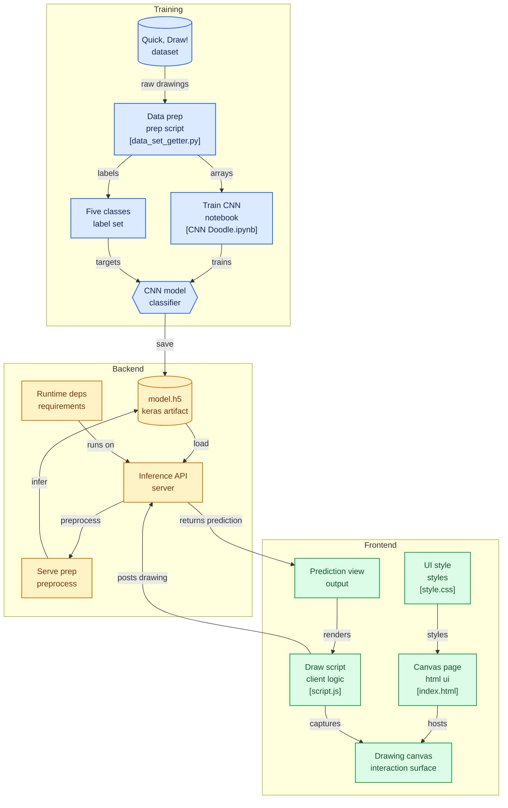

# Doodle QuickDraw System Architecture

```mermaid
flowchart TD

subgraph group_training["Training"]
  node_dataset[("Quick, Draw!<br/>dataset")]
  node_prep_script["Data prep<br/>prep script<br/>[data_set_getter.py]"]
  node_notebook["Train CNN<br/>notebook<br/>[CNN Doodle.ipynb]"]
  node_classes["Five classes<br/>label set"]
  node_model_train{{"CNN model<br/>classifier"}}
end

subgraph group_backend["Backend"]
  node_artifact[("model.h5<br/>keras artifact")]
  node_backend_app["Inference API<br/>server"]
  node_runtime_prep["Serve prep<br/>preprocess"]
  node_deps["Runtime deps<br/>requirements"]
end

subgraph group_frontend["Frontend"]
  node_page["Canvas page<br/>html ui<br/>[index.html]"]
  node_script["Draw script<br/>client logic<br/>[script.js]"]
  node_style["UI style<br/>styles<br/>[style.css]"]
  node_canvas["Drawing canvas<br/>interaction surface"]
  node_result["Prediction view<br/>output"]
end

node_dataset -->|"raw drawings"| node_prep_script
node_prep_script -->|"labels"| node_classes
node_prep_script -->|"arrays"| node_notebook
node_notebook -->|"trains"| node_model_train
node_classes -->|"targets"| node_model_train
node_model_train -->|"save"| node_artifact
node_artifact -->|"load"| node_backend_app
node_deps -->|"runs on"| node_backend_app
node_page -->|"hosts"| node_canvas
node_style -->|"styles"| node_page
node_script -->|"captures"| node_canvas
node_script -->|"posts drawing"| node_backend_app
node_backend_app -->|"preprocess"| node_runtime_prep
node_runtime_prep -->|"infer"| node_artifact
node_backend_app -->|"returns prediction"| node_result
node_result -->|"renders"| node_script

click node_prep_script "https://github.com/akmsdfhjb/doodle/blob/main/data_set_getter.py"
click node_notebook "https://github.com/akmsdfhjb/doodle/blob/main/CNN Doodle.ipynb"
click node_page "https://github.com/akmsdfhjb/doodle/blob/main/doodle-quickdraw/frontend/index.html"
click node_script "https://github.com/akmsdfhjb/doodle/blob/main/doodle-quickdraw/frontend/script.js"
click node_style "https://github.com/akmsdfhjb/doodle/blob/main/doodle-quickdraw/frontend/style.css"

classDef toneNeutral fill:#f8fafc,stroke:#334155,stroke-width:1.5px,color:#0f172a
classDef toneBlue fill:#dbeafe,stroke:#2563eb,stroke-width:1.5px,color:#172554
classDef toneAmber fill:#fef3c7,stroke:#d97706,stroke-width:1.5px,color:#78350f
classDef toneMint fill:#dcfce7,stroke:#16a34a,stroke-width:1.5px,color:#14532d
classDef toneRose fill:#ffe4e6,stroke:#e11d48,stroke-width:1.5px,color:#881337
classDef toneIndigo fill:#e0e7ff,stroke:#4f46e5,stroke-width:1.5px,color:#312e81
classDef toneTeal fill:#ccfbf1,stroke:#0f766e,stroke-width:1.5px,color:#134e4a

class node_dataset,node_prep_script,node_notebook,node_classes,node_model_train toneBlue
class node_artifact,node_backend_app,node_runtime_prep,node_deps toneAmber
class node_page,node_script,node_style,node_canvas,node_result toneMint
```

Would you like to add any **labels** to the arrows or change the **color scheme** of the subgraphs?
